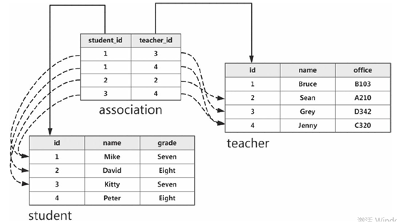

# 第一部分 基础篇
## 第一章 初识Flask
   		Flask：瓶子，烧瓶
		
## 第三章 模版

3.2.3过滤器
过滤器的本质就是函数。
使用方式：

过滤器的使用方式为：变量名 | 过滤器。
{{variable | filter_name(*args)}}
如果没有任何参数传给过滤器,则可以把括号省略掉, flask中过滤器支持链式调用
{{variable | filter_name}}
例子：
from flask import Markup
@app.template_filter()
def musical(s):
return s + Markup(' &#9835;')
{{ name|musical }}-----使用

### 3.3 模版结构组织
 3.3.1 局部模版
 局部可重复利用的html片段，如banner，可以插入到别的独立模版
 
  通常使用下划线开头来命名。
  
  3.3.2 宏
  宏macro当于python中的函数，宏代码保存在html文件中。使用时可以引入并调用。
  3.3.3 模版继承
  定义一个基模版，包含网页的导航栏、页脚等通用内容。每一个继承基模版的子模版在渲染时自动包含这部分内容。
  基模版定义：
  
  
  
   
  
  模版内容追加：{{super()}}
  
  ## 第四章 表单
  ### 创建表单
  1、创建表单
  from flask_wtf import FlaskForm
from wtforms import StringField, PasswordField,BooleanField,SubmitField
from wtforms.validators import DataRequired,Length
class LoginForm(FlaskForm):
    username = StringField('Username', validators=[DataRequired()])
    password = PasswordField('Password', validators=[DataRequired(), Length(min=8)])
    remember = BooleanField('Remember Me')
    submit = SubmitField('Log in')
	2、获取表单数据
	GET方法： request.args
	POST方式：request.form.get('username')
	3、表单验证
	GET方式不验证。
	POST方式验证表单数据：form1.validate_on_submit():
	tips：form的action，如果没有指定URL，默认为当前的URL
	
## 第五章 数据库
Note.query.filter(Note.body=='SHAVE', Note.id==3).all()

Note.query.filter(Note.body=='SHAVE' and Note.id==3).all()

and_:
Note.query.filter(and_(Note.body=='SHAVE' , Note.title=='666')).all()

Note.query.filter(Note.body=='SHAVE').filter(Note.title=='456').all()

like:
Note.query.filter(Note.body.like('%SHAV%')).all()

in:
Note.query.filter(Note.body.in_(['SHAVE'])).all()

not in:
Note.query.filter(~Note.body.in_(['SHAVE'])).all()

filter_by:
Note.query.filter_by(body='SHAVE').all()

Note.query.filter_by(body='SHAVE').filter_by(title='456').all()

limit:
Note.query.limit(2).all()

一对多的关系：
外键 db.ForeignKey('singer.id')创建在“多”侧

属性合集：db.relationship

多对多的关系：
association_table=db.Table('association',
                           db.Column('student_id', db.Integer, db.ForeignKey('student.id')),
                           db.Column('teacher_id', db.Integer, db.ForeignKey('teacher.id'))
                            )
teachers = db.relationship('Teacher', secondary=association_table, back_populates='students')
students = db.relationship('Student', secondary=association_table, back_populates='teachers')

1、创建student teacher记录。 
>>> s1 = Student(name='chenxiaoli')
>>> t1 = Teaceher(name='laoshi')
>>> s2 = Student(name='daijin')
>>> t2 =  Teacher(name='laoshi2')
>>> s3 = Student(name='student3')
>>> t3 =  Teacher(name='laoshi3')
>>> db.session.add(s1)
>>> db.session.add(t1)
>>> sb.session.add(t2)
>>> db.session.add(s2)
>>> db.session.add(s3)
>>> db.session.add(t2)
>>> db.session.add(t3)
>>> db.session.commit()
2、student_id teacher_id赋值（该赋值设计关联表实际测试不成功，非关联表可以）
>>> s1.teacher_id=1
>>> s2.teacher_id=2
>>> db.session.commit()
>>> s1.teachers
[]
>>> t1.student_id=1
>>> t2.student_id=2
>>> s1.teachers
[]
>>> db.session.commit()
3、student、teacher关系关联（列表追加方式，关联表下可以。）
>>> s1.teachers.append(t1)
>>> s1.teachers.append(t2)
>>> s1.teachers
[Teacher 'laoshi1', Teacher 'laoshi2']
>>> db.session.commit()
>>> t1.students
[Student 'chenxiaoli']

数据库迁移Migrate
安装flask-migrate

创建迁移环境
flask db init
生成迁移脚本--flask db migrate -m "add note timestamp"
更新数据库--flask db upgrade

